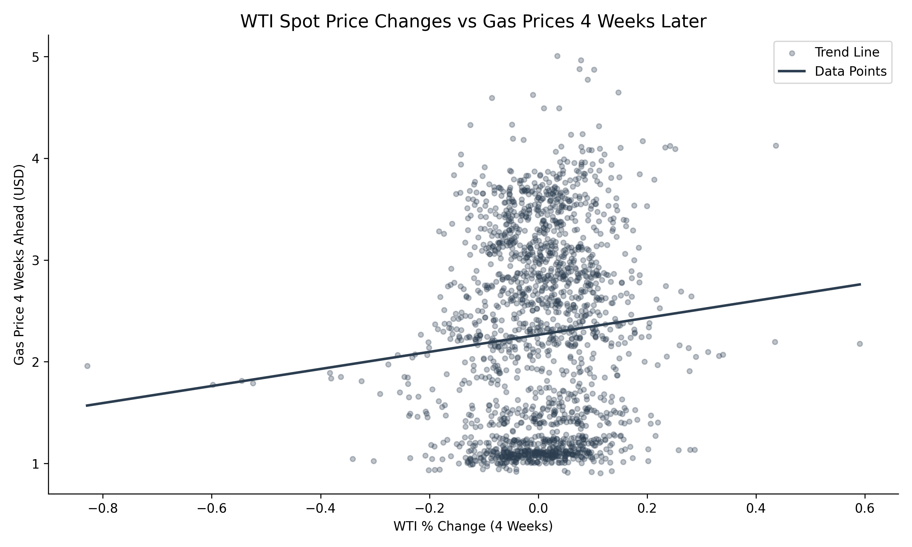

# Machine Learning Model predicts next month's gas price

## Hook

Gas prices seem unpredictable, rising and falling without clear warning. But what if changes in oil prices today could help forecast what drivers will pay at the pump weeks from now?

## Problem Statement

Gasoline prices play a critical role in the daily lives of consumers and the operations of businesses, yet they remain difficult to predict. These prices are influenced by a combination of factors including crude oil costs, refining processes, distribution networks, and broader economic conditions. While crude oil is the primary input in gasoline production, the relationship between oil prices and retail gasoline prices is not immediate or perfectly linear. Instead, changes in oil prices tend to affect gasoline prices with a delay, making short-term forecasting challenging.

This project focuses on understanding whether movements in West Texas Intermediate (WTI) crude oil prices can be used to predict the average U.S. gasoline price four weeks into the future. By narrowing the problem to a specific time horizon and key predictor, the analysis aims to uncover whether a consistent and useful predictive relationship exists.

## Solution Description

This project uses historical data on oil prices, gasoline prices, and economic conditions to build a model that estimates future gasoline prices. By analyzing weekly trends and incorporating past gasoline prices along with recent changes in oil prices, the model identifies patterns that can signal where prices are headed.

Rather than attempting to perfectly predict the market, the goal is to provide a data-driven estimate that helps users better anticipate changes in fuel costs. This can support more informed decision-making for individuals planning expenses, businesses managing transportation costs, and analysts studying energy markets. The approach simplifies complex market behavior into an understandable and actionable prediction.

## Chart

Below is an example visualization showing the relationship between weekly WTI oil prices and U.S. gasoline prices over time. The chart highlights how movements in oil prices tend to precede similar trends in gasoline prices, supporting the idea that oil prices can be used as a leading indicator.

*Relationship between WTI crude oil price changes and average U.S. gasoline prices four weeks later. Despite substantial dispersion in the data, the positive slope of the fitted line suggests that oil price movements provide some predictive signal for future gasoline prices, though other factors contribute to variability.*